---

# 💡 Tech Tips & Tricks

## 🚀 Live Site → [https://tech-tips-frontend-six.vercel.app](https://tech-tips-frontend-six.vercel.app)

### 🖥️ Backend API → [https://tech-tips-backend-1.onrender.com](https://tech-tips-backend-1.onrender.com)

**Tech Tips & Tricks** is a modern **full-stack web platform** built for tech enthusiasts who love to learn, teach, and share their technical knowledge.
It delivers expert insights, user-generated tutorials, and real-world experiences across topics like **AI tools, software troubleshooting, web development, gadgets, and productivity** — all in one place.

---

## 🧭 Project Overview

This project empowers users to **create, explore, and engage** with high-quality tech content while fostering a vibrant learning community.
It’s built using a **Dockerized MERN stack** with **Next.js + Express + MongoDB**, and deployed via **Vercel (frontend)** and **Render (backend)**.

---

## ⚡ Key Features

### 🧑‍💻 Authentication & Profiles

* Secure **JWT-based** authentication
* **Google & GitHub OAuth 2.0** login integration
* Two roles: **User** and **Admin**
* Profile editing (name, bio, image, etc.)
* Follow/Unfollow system with live updates
* Verified badges for premium members

---

### 📝 Post Management

* Create, edit, and delete posts with image uploads
* Categorization by topic (AI, Web Dev, Software, etc.)
* Draft mode and image preview
---

### 💬 Social Interaction

* Upvote / Downvote system
* Comment threads with edit & delete
* Real-time replies and notifications
* Share posts to social media

---

### 💸 Payments & Membership

* Integrated with **Aamarpay** and **Stripe**
* Premium membership for exclusive content
* Verified badge for paid users
* Admin dashboard with payment analytics

---

### 📊 Dashboards

* **User Dashboard:**

  * Post analytics (views, likes, comments)
  * Payment history & subscription status
* **Admin Dashboard:**

  * Revenue charts
  * Manage users & posts
  * Content moderation tools

---

### 🔍 Smart Feed & Search

* Infinite scroll feed
* Debounced keyword search
* Filter by category, author, or premium status
* Sort by trending or most upvoted

---

### 🎨 Design & UX

* Built with **HeroUI**, **TailwindCSS**, and **Framer Motion**
* Fully responsive across all devices
* Dark/Light mode with smooth transitions
* Elegant UI animations and clean layouts

---

### 🔒 Security

* JWT with refresh tokens
* Encrypted password reset flow
* OAuth 2.0 login for Google & GitHub
* Admin activity logs
* Safe file uploads via **Formidable + Cloudinary**

---

## 🧠 Bonus Highlights

| Feature       | Description                                                     |
| ------------- | --------------------------------------------------------------- |
| 📊 Analytics  | Interactive charts using `recharts` & `react-chartjs-2`         |
| 🔁 Sharing    | One-click social post sharing                                   |
| 🕵️‍♂️ Logs   | Admin-level activity and moderation logs                        |
| 🐳 Deployment | **Dockerized full-stack app**, deployed via **Render + Vercel** |

---

## ⚙️ Tech Stack

### 🖥️ Frontend

* **Next.js (App Router + Turbopack)**
* **React + Redux Toolkit + Redux Persist**
* **TailwindCSS + HeroUI + Framer Motion**
* **React Hook Form + Zod Validation**

### ⚙️ Backend

* **Node.js + Express.js**
* **MongoDB + Mongoose**
* **JWT Authentication + OAuth2 (Google, GitHub)**
* **Stripe / Aamarpay Payment Integration**
* **Cloudinary** for secure media uploads
* **Docker** for containerized deployment

### 🧰 Utilities

* **Axios** for API & uploads
* **SweetAlert2** / **Sonner** for alerts
* **React Spinners**, **Timeago**, **LightGallery**, **Photo View** for UX

---

## 🐳 Deployment Architecture

| Layer    | Service         | Hosting             | Description                |
| -------- | --------------- | ------------------- | -------------------------- |
| Frontend | Next.js         | **Vercel**          | Static + SSR frontend      |
| Backend  | Express.js      | **Render (Docker)** | REST API + Auth + Payments |
| Database | MongoDB         | **MongoDB Atlas**   | Cloud NoSQL storage        |
| Media    | Cloudinary      | **Cloud Storage**   | Image uploads              |
| OAuth    | Google & GitHub | —                   | Social login integration   |

---

## 🖼️ Project Screenshots

*(All screenshots are located in the `public/` directory.)*

<details>
<summary>Show Screenshots</summary>

#### 🏠 Main Pages

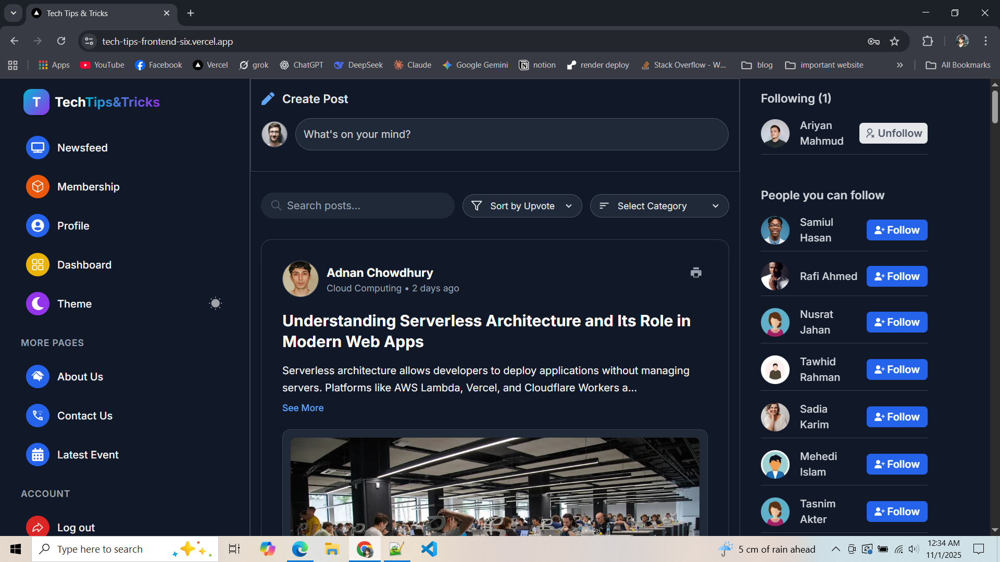
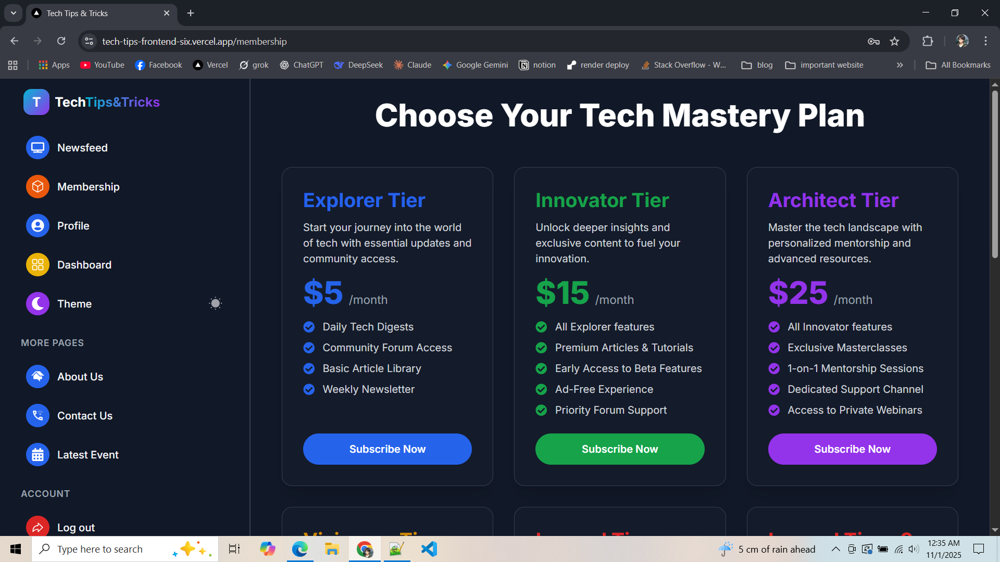
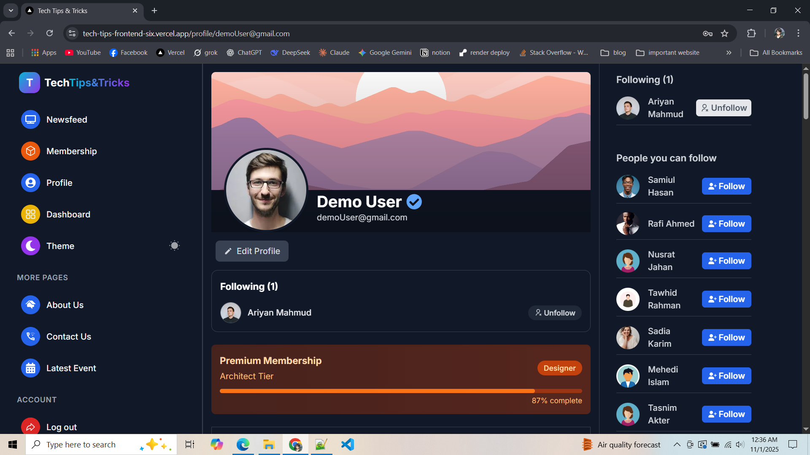
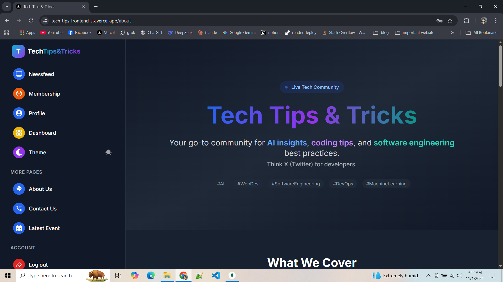
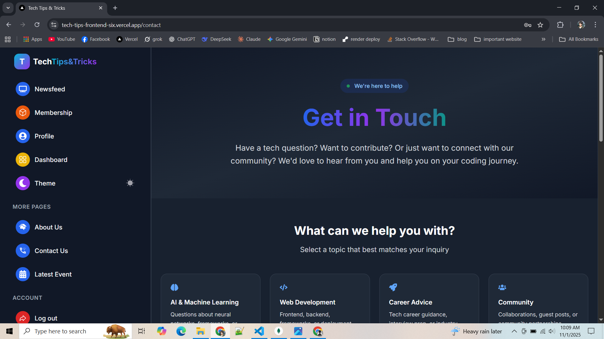

#### 🧑‍💻 User Dashboard

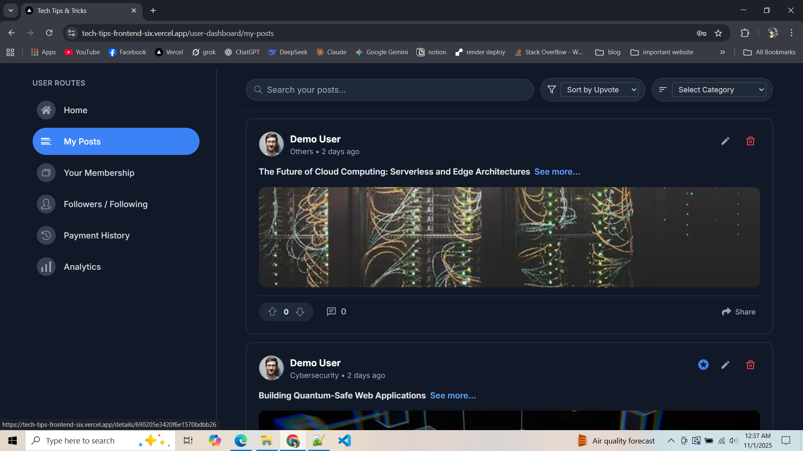
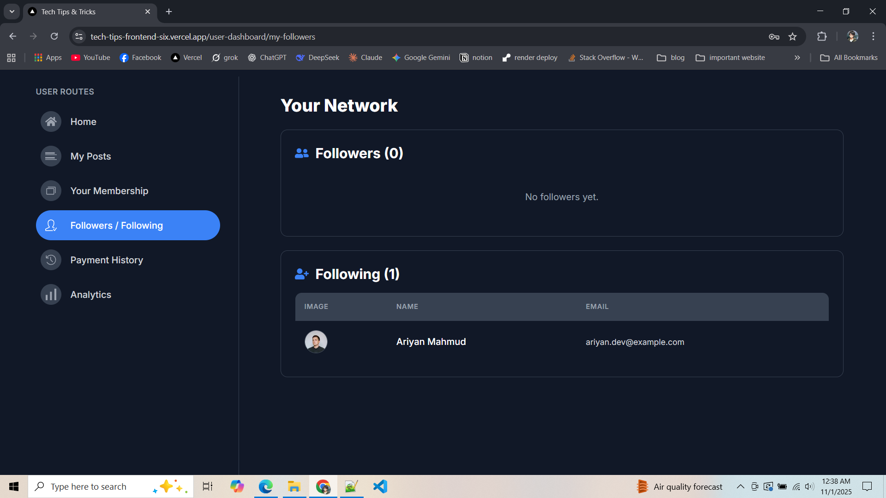
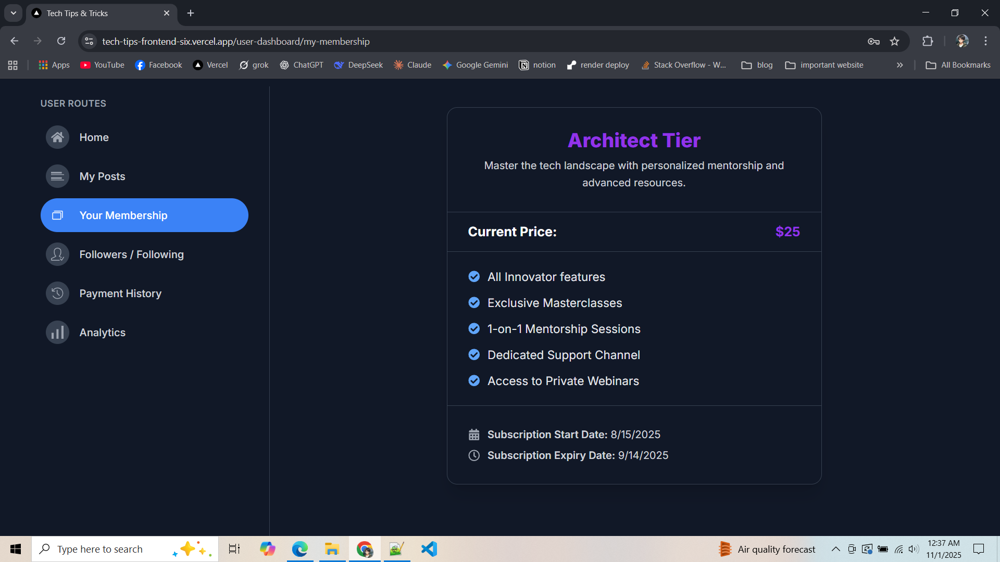
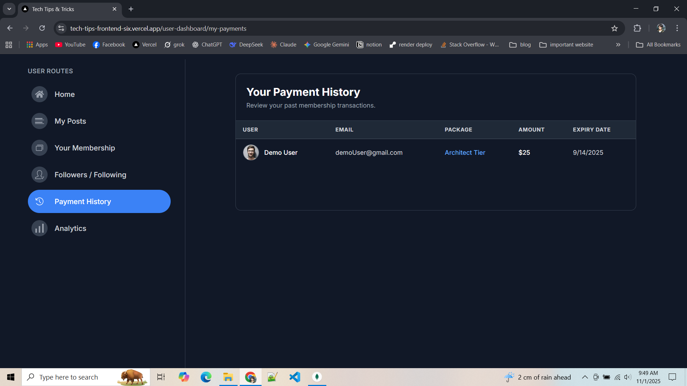

#### 🛠️ Admin Dashboard

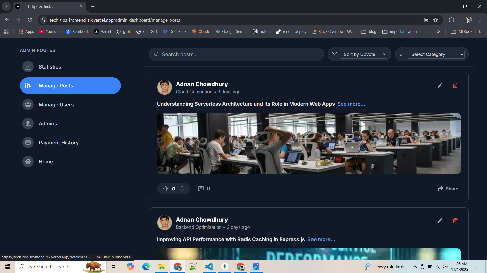
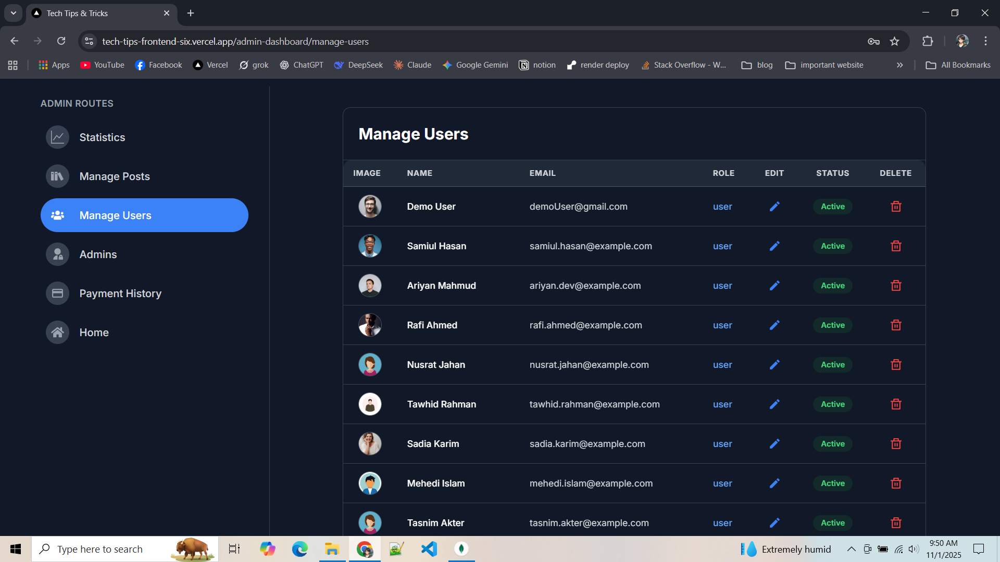
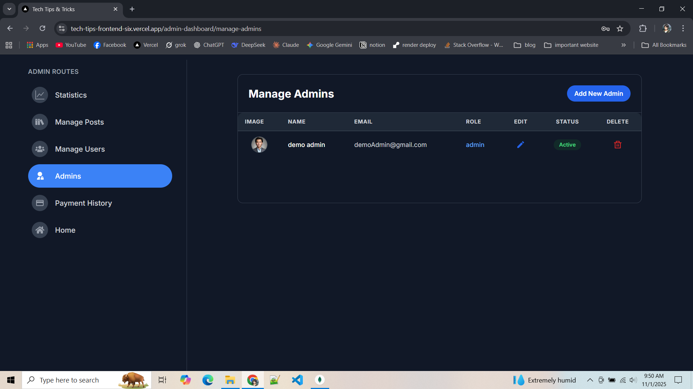
.png)

</details>

---

## 🧩 Installation & Setup (Local)

### 1️⃣ Clone the Repository

```bash
git clone https://github.com/tanzimsiamm/tech-tips-frontend.git
cd tech-tips-frontend
```

### 2️⃣ Install Dependencies

```bash
npm install
```

### 3️⃣ Create `.env.local`

### 4️⃣ Run Development Server

```bash
npm run dev
```

---

## 🐋 Docker Setup (Full Stack)

If you want to run both backend & frontend locally with Docker:

```bash
docker-compose up --build
```

Then visit:

* Frontend → [http://localhost:3000](http://localhost:3000)
* Backend → [http://localhost:5000](http://localhost:5000)

---

## 🌐 Production Deployment

| Service  | Platform            | URL                                                                                            |
| -------- | ------------------- | ---------------------------------------------------------------------------------------------- |
| Frontend | **Vercel**          | [https://tech-tips-frontend-six.vercel.app](https://tech-tips-frontend-six.vercel.app)         |
| Backend  | **Render (Docker)** | [https://tech-tips-tricks-backend.onrender.com](https://tech-tips-tricks-backend.onrender.com) |
| Database | **MongoDB Atlas**   | Managed cloud DB                                                                               |
| Media    | **Cloudinary**      | Secure file uploads                                                                            |

---

## 🏁 Status

✅ **Fully deployed & production-ready**
✅ **Dockerized full-stack architecture**
✅ **OAuth (Google, GitHub) + Payments integrated**

---
